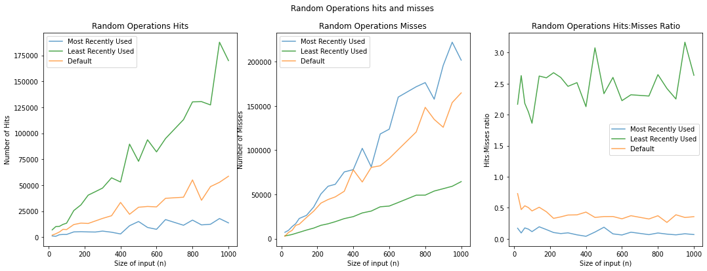

# CS44800 Project 1
## Aryan Wadhwani (wadhwani@purdue.edu)
## Teammate - Shayne Marques

## Implementation Notes
 - I used `txnum >= 0` to determine whether a buffer was in either array. To implement assertions in some portions of the code, I added `bufferpool[10000] = 0`, to ensure a crash occurs. 
 - To use the default implementation instead of MRU, we can use `bm.setMode(false)`
 - To view hits and misses, you can use `bm.hits` and `bm.misses`
 - To access the database from an EmbeddedDriver, I've added a method called `getDb()`. This can be used to get the BufferMgr through `driver.getDb().bufferMgr()`
 - Writes can also be accessed using `bm.discWrites`.

## Testing + Profiling:
I look at hits misses and writes for the buffers. I look at various database operations that may be done, and also look at a general case where a randomized set of queries is made. 

 

See `simpledb.buffer.BufferMgrProfiling.java`. Generally steps for each measurment are as follows:
 - Generate database of size `n` tuples
 - Reset `bm.hits`, `bm.misses` and `bm.discWrites` counts to 0
 - Perform operation and view number of hits, misses and disc writes
 - Store data in appropriate csv file.
 - Generate Visualization comparing default implementation to MRU implementation of buffer manager

## Visualizations
See `CS_448_Project_1_Analysis.ipynb` and `CS_447_Project_1_Group_Analysis.ipynb`

## Data for Visualizations (Output from Profiling) 
See `LRU Tests/` and `MRU Tests/`